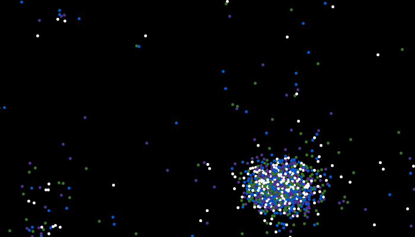

Multithreaded interactive gravity simulation
===

Interactive gravity simulation including short range repulsion forces. SDL is used to draw the particles and handle user interaction.

I originally coded this in 2015 (or earlier?) so the code isn't the best. 
The multithreading is done with SDL_Threads inside PhysicsHandlerThreaded.cpp.

If I were to rewrite this, I'd add better benchmarking data, make the memory structure of the quadtree more compact, and redo most of the rendering code.

Libraries needed are boost, SDL2 and SDL2_image, and glm.

